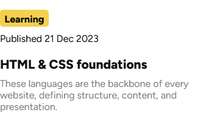

# Frontend Mentor - Blog preview card solution

This is a solution to the [Blog preview card challenge on Frontend Mentor](https://www.frontendmentor.io/challenges/blog-preview-card-ckPaj01IcS). Frontend Mentor challenges help you improve your coding skills by building realistic projects. 

## Table of contents

  - [Links](#links)
  - [Built with](#built-with)
  - [What I learned](#what-i-learned)
  - [Continued development](#continued-development)
  - [Author](#author)

**Note: Delete this note and update the table of contents based on what sections you keep.**

### Links

- Solution URL: [Blog Preview Card Repo](https://github.com/ysstudio22/Blog-Preview-Card)
- Live Site URL: [Blog Preview Card GitHub Page](https://ysstudio22.github.io/Blog-Preview-Card/)

### Built with

- Semantic HTML5 markup
- CSS custom properties
- Flexbox

### What I learned
   The thing that caught my eye after looking the design was the "Learning" label on the card as shown below.

  

   There were perhaps a couple of options to write this out, but I went with using a span element.

   ```HTML
   <div id="label">
    <span>Learning</span>
   </div>
   ```
   ```CSS
    #label {
        height: 1.75rem;
        width: 5rem;
        background-color: var(--Yellow);
        border-radius: 5px;
        texta-align: center;
    }

    span {
        color: var(--Black);
        padding: 10px 0;
        display: inline-block;
        position: relative;
        bottom: 4px;
        font-weight: 800;
        }
   ```
    It was interesting styling the span element and getting the element to be as close as the design.

    This challenge was also an opportunity to review adding box shadows and using the hover pseudo selector.

### Continued development
    I'd like to use this solution in an actual blog homepage and enabling a filtering feature.

## Author

- Frontend Mentor - [@ysstudio22](https://www.frontendmentor.io/profile/ysstudio22)
- X - [@YoshiCode03](https://x.com/YoshiCode03)

